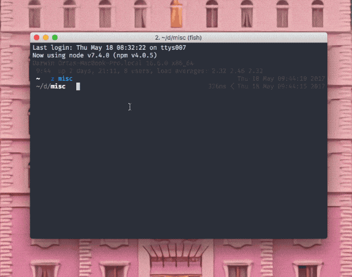

# yeoman-generator-artsy

A Yeoman generator for:

1. Quickly making TypeScript CLI tools



This will help you get set up to make a TypeScript CLI for a quick one-off project.

## Meta

* __State:__ production
* __Point People:__ [Orta](https://github.com/orta)

## Usage

Install Yeoman:

```
yarn global add yo
yarn global add generator-artsy
```

Then run `yo artsy`.

## How do I work on this?

Run `npm link` inside this repo and then it should be used for `yo artsy`.
