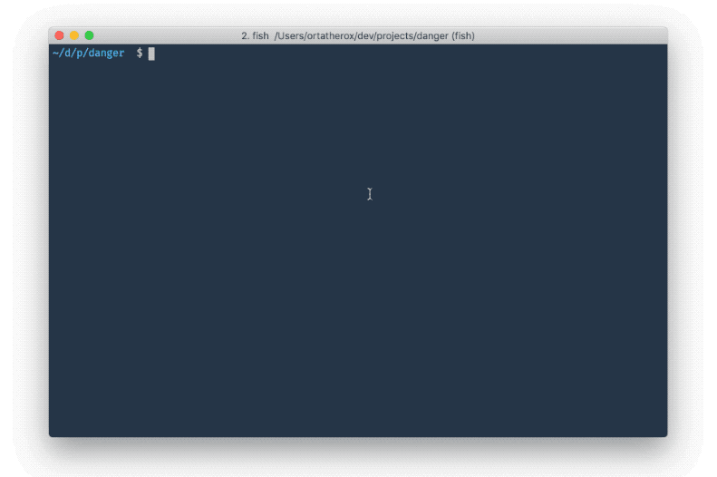

# yeoman-generator-artsy

A [Yeoman](http://yeoman.io) [generator](http://yeoman.io/generators/) for quickly making TypeScript + node projects.

<center></center>

## Meta

* __State:__ production
* __Point People:__ [Orta](https://github.com/orta)

## Usage

Install Yeoman:

```sh
yarn global add yo
yarn global add generator-artsy
```

Then run `yo artsy`.

## How do I work on this?

Run `npm link` inside this repo and then it will be used for `yo artsy`.
